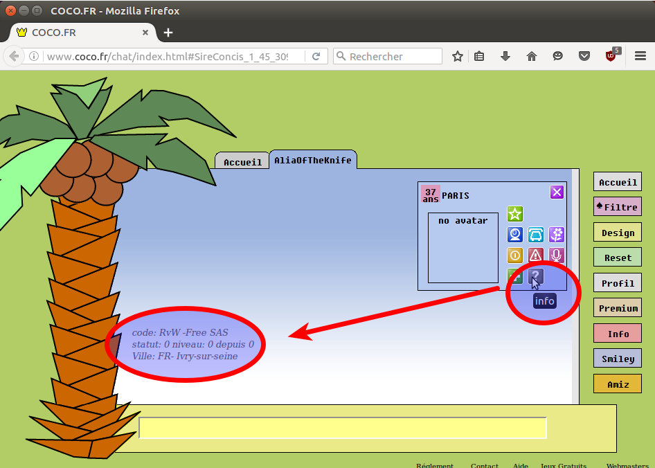

# Bouton information : donne le code de vote, la ville de connexion, le fournisseur d'accès, ... #

Un abonnement Premium permet de visualiser le _code de vote_, le _FAI_, le _statut_, le _niveau_, le _temps de connexion_ et la _ville de connexion_ présumée d'un pseudo.

Par exemple voici les informations affichées en appuyant sur le bouton information en forme de point d'interrogation :

  * **Code de vote** : RvW
  * **Fournisseur d'accès** : Free SAS
  * **Statut** : 0
  * **Niveau** : 0
  * **Temps de connexion** : 0 minute
  * **Ville de connexion** : FR- Ivry-sur-seine.
Dans l'exemple précédent, l'internaute est bien connecté depuis Ivry-sur-seine.

Autre exemple :
  * **Code de vote** : MYY
  * **Fournisseur d'accès** : Orange
  * **Statut** : 0
  * **Niveau** : 18
  * **Temps de connexion** : 43 minutes
  * **Ville de connexion** : FR- Juvisy-sur-orge

La ville de connexion est la géolocalisation de l'adresse IP de l'internaute fournie pas « Coco.fr ». Cette  géolocalisation n'est  pas fiable. Dans notre exemple précis l'internaute est faussement géolocalisé à Juvisy-sur-Orge, soit à une vingtaine de kilomètres de sa localisation réelle qui est en fait Paris.

Certaines de  informations comme le _code de vote_, le _FAI_ et la _ville de connexion_ sont récupérées par le script « _save-logged-user-in-database.pl_ » et enregistrées en base de données.

## Le code de vote ##

Un _code de vote_ est composé de trois caractères alphanumériques sensibles à la case. Donc un caractère peut prendre une valeur de « _A_ » à « _Z_ », de « _a_ » à « _z_ » ou de « _0_ » à « _9_ » soit soixante-deux valeurs différentes. Donc il existe 62 x 62 x 62 = 238 328 possibilités de _codes de vote_.

Voici quelques exemples de _codes de vote_ : « _uhy_ », « _MYY_ », « _6eF_ », « _kVO_ », « _WcL_ »,« _PXd_ », « _uyI_ », « _0fN_ » , « _rs6_ », « _JiC_ ».

Un _code de vote_ ne peut pas identifier de façon unique un pseudonyme :
  * Certains pseudonymes partagent le même _code de vote_
  * Si l'Internaute utilise la navigation privée ou efface ses cookies un nouveau _codes de vote_ sera généré.

### Exemple d'utilisateur partageant le même code de vote ###

#### Exemple 1 : partage du code de vote « MYY » ####

Dans cet exemple, ces quatre pseudos utilisent le code de vote « MMY » pourtant ce sont des utilisateurs différents :

| **nickname**       | **nickID** | **ISP**              | **town**                | **age** | **sex** | **city**          | **creation\_date**  | **logout**         | **update\_date**    | **code** |
|:-------------------|:-----------|:---------------------|:------------------------|:--------|:--------|:------------------|:--------------------|:-------------------|:--------------------|:---------|
| laura9             | 380361     | Bouygues Telecom     | FR-                     | 18      | 2       | 75002 Paris       | 12-31 18:28:03      | 12-31 18:34:02     | 12-31 18:33:40      | MYY      |
| BoBllackSerieu     | 236321     | SFR                  | Trilport                | 20      | 1       | 75005 Paris       | 01-05 01:31:41      | 01-05 01:37:40     | 01-05 01:37:11      | MYY      |
| sylvia             | 161508     | Bouygues Telecom     | Le Plessis              | 25      | 2       | 92140 Clamart     | 01-11 09:00:41      | 01-11 09:15:14     | 01-11 09:11:12      | MYY      |
| Oxymore2           | 388603     | Orange               | Paris                   | 18      | 7       | 75015 Paris       | 01-26 17:05:12      | 01-26 17:05:44     | 01-26 17:05:12      | MYY      |

Ces informations sont extraites de la base données par « _db-search.pl_ ». Le champ **town** est en fait la ville de connexion présumée donnée par la géolocalisation de « Coco.fr ».

Comment savoir si ces utilisateurs sont bien des utilisateurs différents ?

  * Les champs **ISP** et **town** sont différents,  cela donne une indication, mais ce n'est pas un certitude.
  * Le champ **city** correspond au code postal rentré par l'utilisateur dans le formulaire de connexion, sa pertinence n'est pas fiable, mais certains utilisateurs entrent toujours le même code postal cela permet d'aider à les identifier.
  * Un code sexe de « 2 » est un pseudo femme sans image d'avatar alors qu'un code sexe de « 7 » est un pseudo femme avec une image. Une fois qu'un utilisateur a défini une image il ne peut plus la  supprimer.

Toujours pour le code de vote « MMY » nous avons ces relevés de connexions :

| **nickname**       | **nickID** | **ISP**              | **town**                | **age** | **sex** | **city**          | **creation\_date**  | **logout**         | **update\_date**    | **code** |
|:-------------------|:-----------|:---------------------|:------------------------|:--------|:--------|:------------------|:--------------------|:-------------------|:--------------------|:---------|
| Laws               | 242662     | Orange               | Issy-les-moulineaux     | 18      | 2       | 75015 Paris       | 10-24 22:39:03      | 10-24 22:41:03     | 10-24 22:40:11      | MYY      |
| Laws               | 326588     | Orange               | Paris                   | 18      | 2       | 75015 Paris       | 10-26 13:43:03      | 10-26 13:45:03     | 10-26 13:44:03      | MYY      |
| Laws               | 293361     | Orange               | FR-                     | 18      | 2       | 75015 Paris       | 11-01 19:12:03      | 11-01 19:19:03     | 11-01 19:18:12      | MYY      |
| Laws               | 155020     | Orange               | Coulommiers             | 18      | 2       | 75015 Paris       | 11-16 12:20:03      | 11-16 12:38:03     | 11-16 12:37:11      | MYY      |
| Laws               | 382157     | Orange               | Paris                   | 18      | 7       | 75015 Paris       | 12-15 10:30:11      | 12-15 11:07:41     | 12-15 11:07:11      | MYY      |
| Laws               | 191716     | Orange               | Chatillon               | 18      | 7       | 75015 Paris       | 12-18 09:11:11      | 12-18 09:57:03     | 12-18 09:56:41      | MYY      |
| Laws               | 161964     | Free SAS             | Annezin                 | 18      | 7       | 75015 Paris       | 12-28 14:19:41      | 12-28 14:20:41     | 12-28 14:20:11      | MYY      |
| Laws               | 255777     | SFR                  | Saint-barnabe           | 18      | 7       | 75015 Paris       | 01-03 15:46:02      | 01-03 15:47:02     | 01-03 15:46:40      | MYY      |
| Laws               | 337794     | Orange               | Juvisy-sur-orge         | 18      | 7       | 75015 Paris       | 01-31 17:48:42      | 01-31 18:16:43     | 01-31 18:16:12      | MYY      |

Dans ce cas précis l'utilisateur est le même, mais la ville de connexion présumée a changé et son fournisseur d'accès aussi.

La ville de connexion présumée peut changer pour deux raisons :
  * La première raison est qu'Orange n'assigne pas toujours la même adresse IP à l'utilisateur, l'adresse IP de l'Internaute n'est pas fixe. Cela signifie que même si l'utilisateur n'a pas bougé physiquement, son point de connexion présumé lui peut changer en fonction de la géolocalisation de l'adresse IP. Par exemple pour les connexions à _Issy-les-moulineaux_, _Châtillon_ et _Paris_ la personne est toujours au même endroit géographiquement à Paris, mais avec une adresse IP différente.
  * La deuxième raison est que l'utilisateur peut aussi bouger physiquement. Par exemple la connexion _Saint-barnabe_ correspond à une connexion à _Le Lavandou_, l'utilisateur s'étant déplacé géographiquement de plusieurs centaines de kilomètres.
  * Le 15 décembre le code sexe a changé de « 2 » (femme sans image en avatar) à « 7 » (femme avec une image en avatar). L'utilisateur a défini une image en avatar ce jour là. ne fois l'avatar défini il ne peut être supprimé

#### Exemple 2 : utilisateur ayant effacé son historique ####

Nous avons ces relevés de connexions pour le même utilisateur connecté sur le même ordinateur situé géographiquement au même endroit :

| **nickname**        | **nickID** | **ISP**   | **town**             | **age** | **sex** | **city**      | **creation\_date** | **logout**       | **update\_date**  | **code** |
|:--------------------|:-----------|:----------|:---------------------|:--------|:--------|:--------------|:-------------------|:-----------------|:------------------|:---------|
| Shurouk             |  166266    | Orange    | Paris                | 30      | 2       | 75008 Paris   | 11-07 13:14:02     | 11-07 13:45:03   | 11-07 13:44:11    |  1Ml     |
| Shorouk             |  299301    | Orange    | Paris                | 30      | 2       | 75008 Paris   | 11-08 08:48:02     | 11-08 13:43:02   | 11-08 13:42:11    |  WUL     |
| MissTheSun          |  210129    | Orange    | Paris                | 30      | 2       | 75008 Paris   | 11-14 10:41:02     | 11-14 11:09:03   | 11-14 11:08:11    |  dr6     |
| ClapClapBouummm     |  141687    | Orange    | Paris                | 30      | 2       | 75002 Paris   | 11-15 10:49:02     | 11-15 10:53:03   | 11-15 10:52:12    |  NcU     |
| Nenuphar            |  331867    | Orange    | Paris                | 30      | 2       | 75008 Paris   | 11-19 09:05:12     | 11-19 09:14:02   | 11-19 09:13:11    |  aPx     |
| GoutteDePluie       |  398632    | Orange    | Asnieres             | 30      | 2       | 75008 Paris   | 11-21 09:50:02     | 11-21 14:07:03   | 11-21 14:06:12    |  aPx     |
| LittleStarlette     |  334356    | Orange    | Chatenay-malabry     | 30      | 2       | 75005 Paris   | 11-25 11:17:06     | 11-25 11:26:03   | 11-25 11:25:03    |  aPx     |
| BelleSorciere       |  107067    | Orange    | Clichy               | 30      | 2       | 75002 Paris   | 12-02 09:52:40     | 12-02 10:00:40   | 12-02 10:00:11    |  aPx     |
| Liloulalaloulou     |  132213    | Orange    | Clichy               | 30      | 2       | 75008 Paris   | 12-02 12:27:41     | 12-02 12:30:41   | 12-02 12:30:11    |  ZzU     |
| LiLou               |  132768    | Orange    | Clichy               | 30      | 2       | 75002 Paris   | 12-02 12:31:02     | 12-02 12:35:02   | 12-02 12:34:40    |  p0F     |
| LoupDentelle        |  301875    | Orange    | Clichy               | 30      | 2       | 75002 Paris   | 12-03 09:57:02     | 12-03 10:04:41   | 12-03 10:04:12    |  uhy     |
| VentDhiver          |  301502    | Orange    | Puteaux              | 30      | 2       | 75002 Paris   | 12-09 10:32:41     | 12-09 12:41:41   | 12-09 12:41:12    |  uhy     |
| RougeAlevres        |  141518    | Orange    | Cergy                | 30      | 2       | 75002 Paris   | 12-10 11:09:40     | 12-10 13:57:03   | 12-10 13:56:40    |  uhy     |
| Pandora             |  323985    | Orange    | Saint-ouen           | 89      | 2       | 75002 Paris   | 12-17 10:04:03     | 12-17 13:56:41   | 12-17 13:56:02    |  uhy     |
| MaryChristmas       |  114097    | Orange    | Asnieres             | 30      | 2       | 75002 Paris   | 12-26 11:01:41     | 12-26 12:44:40   | 12-26 12:44:11    |  uhy     |
| Matrioshka          |  286422    | Orange    | Asnieres             | 30      | 7       | 75002 Paris   | 12-27 10:22:40     | 12-27 14:05:40   | 12-27 14:05:11    |  uhy     |
| VernisViolet        |  312601    | Orange    | Colombes             | 30      | 7       | 75002 Paris   | 12-31 10:14:03     | 12-31 12:19:02   | 12-31 12:18:40    |  uhy     |
| Swallow             |  127751    | Orange    | Meudon               | 30      | 7       | 75005 Paris   | 01-07 09:50:41     | 01-07 10:26:41   | 01-07 10:26:11    |  uhy     |
| NormaJeanBaker      |  146669    | Orange    | Neuilly-sur-seine    | 30      | 7       | 75002 Paris   | 01-10 11:04:03     | 01-10 13:17:42   | 01-10 13:17:13    |  uhy     |
| AbsolutelyFab       |  137049    | Orange    | Chaville             | 30      | 2       | 75002 Paris   | 01-17 10:18:43     | 01-17 13:49:45   | 01-17 13:49:15    |  uhy     |
| MorticiaAddams      |  215463    | Orange    | Gennevilliers        | 30      | 7       | 75002 Paris   | 01-27 11:03:13     | 01-27 13:35:40   | 01-27 13:35:11    |  uhy     |
| FridaKhalo          |  319446    | Orange    | Rueil-malmaison      | 30      | 7       | 75002 Paris   | 02-03 12:22:12     | 02-03 14:01:41   | 02-03 14:01:11    |  uhy     |
| GenteDame           |  180664    | Orange    | Parmain              | 30      | 7       | 75002 Paris   | 02-04 10:14:42     | 02-04 13:52:42   | 02-04 13:52:11    |  uhy     |
  * On remarque que le code de vote a changé huit fois passant successivement des valeurs 1Ml, WUL, dr6, NcU, aPx, ZzU, p0F et uhy. Ce changement est sûrement la conséquence de l'effacement des données de navigation.
  * On remarque que les points de connexions donnés par la géolocalisation de Coco.fr ont changé en passant par _Paris_, _Asnieres_, _Chatenay-malabry_, _Clichy_, _Puteaux_, _Cergy_, _Saint-ouen_, _Asnieres_,  _Colombes_, _Meudon_, _Neuilly-sur-seine_, _Gennevilliers_, _Rueil-malmaison_ et _Parmain_ . Pourtant l'utilisateur n'a pas bougé géographiquement et se trouvait dans le 8e arrondissement de Paris.
  * On remarque aussi le code postal entré par l'utilisateur dans le formulaire change aussi suivant son humeur.
  * Enfin on remarque que l'utilisateur a défini une image pour son avatar le 27 décembre. Une fois l'avatar défini il ne peut être supprimé, à moins d'effacer les données de navigation. Cependant le 17 janvier l'avatar n'a pas été chargé, sûrement à cause d'un dysfonctionnement de Coco.fr. On peut imaginer que la requête qui charge l'avatar sur « http://pix.coco.fr/ » a échoué suite à une surcharge dur serveur.
