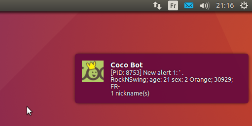
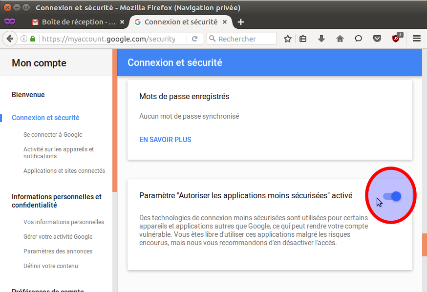

# Introduction #

Le [script « save-logged-user-in-database.pl »](saveLoggedUserInDatabase.md) permet de déclencher certaines alertes. Une alerte est soit un message _XMPP_ ou soit un message envoyé à l'utilisateur connecté.

Des alertes peuvent-être déclenchées en analysant les propriétés des utilisateurs connectés, par exemple on peut déclencher une alerte si l'utilisateur avec le pseudo « Laws » se connecte, ou si un pseudo femme de trente ans se connecte, ou encore si un pseudo se connecte avec un code de vote « MYY ».

L'option « -A » du « save-logged-user-in-database.pl » active la fonction des alertes et le fichier « conf/alert.conf » est utilisé.

## La section `<alert>` ##

Le fichier « alert.conf » comporte la section `<alert>` pour déclarer une nouvelle alerte.

Exemple :
```
  <alert>
      enable    = 1
      condition = $mynickname eq 'Laws'
      transport = XMPP
      recipient = cocoxmpp
  </alert>
```

Dans cette exemple une alarme de type _XMPP_ est déclenché si un pseudonyme « Laws » est connecté.

Les différentes directives sont :
  * enable :  « 1 » l'alerte est activée ou « 0 » elle est désactivée.
  * condition : condition requise pour que l'alerte soit prise en compte. Les conditions sont du code Perl. Plusieurs directives _condition_ peuvent exister, il suffit qu'une soit vraie pour que l'alerte soit déclenchée.
  * transport : type d'alerte _XMPP_ ou _Message_.
  * recipient : gestionnaire de l'alerte.


### Les conditions ###

Les directives conditions utilisent les propriétés de l'objet _Cocoweb::user::Connected_. En voici une liste non exhaustive :
  * mynickname : le pseudonyme
  * myage : l'âge
  * mysex : le sexe : 1 ou 6 pour un homme, 2 ou 7 pour une femme
  * citydio : le code spécifique correspondant au code postal. Si cette valeur est comprise entre 30915 et 30935 l'utilisateur à entré un code postal de la ville de Paris.
  * myver : 4 si l'utilisateur dispose d'un abonnement Premium
  * isRecent : 1 si l'utilisateur vient de se connecter sur le tchat ou de se reconnecter en changeant certaines propriétés, comme le pseudo, l'âge, le sexe, ...
  * ISP : le FAI utilisé comme « Free SAS », « Orange » ou « SFR ».
  * town : le point de connexion. Exemples : « FR- Neuilly-sur-seine », « FR- Paris », « FR- Sevran" », ...
  * isMessageWasSent : l'utilisateur a envoyé au moins un message.

Plusieurs directives _condition_ peuvent se suivre. L'alerte est déclenchée si au moins une des directives _condition_ est vraie.

Exemple l'alerte sera déclenchée si un utilisateur avec le pseudonyme femme « Laws » ou un utilisateur avec le code de vote « uhy » est connecté :
```
 condition = $mynickname eq 'Laws' and ($mysex eq "2" or $mysex eq "7")
 condition = $code eq 'uhy'
```


Les conditions sont du code Perl et peuvent comporter des opérateurs comme _and_ ou _or_ ainsi que des parenthèses :

```
  condition = ($town eq "FR- Aulnay-sous-bois" or $town eq "FR- Sevran") and $ISP eq "Free SAS" and $mysex eq "2" and $citydio >= 30915 and $citydio <= 30935 and $mynickname ne "ghete" and $mynickname ne "stephanie" and  $code ne 'KEx' and $code ne 'Sf4' 
```

## La section `<XMPP>` ##

La section `<XMPP>` sert à déclarer le gestionnaire de l'alerte de type _XMPP_. Dans notre exemple se base une un compte _Google Talk_. Cependant avec l'apparition de _Google Hangouts_ il n'est pas certain qu'un compte _Google_  nouvellement créé fonctionne avec les protocoles _XMPP_.


Voici un exemple de gestionnaire d'alerte _XMPP_ :
```
  <XMPP>
    name           = cocoxmpp
    hostname       = talk.google.com
    port           = 5222
    componentname  = gmail.com 
    connectiontype = tcpip 
    tls            = 1
    username       = mon.utilitsateur.gmail
    password       = mon.mot.de.passe.gmail
    to             = utilisateur.a.prevenir@gmail.com
    resource       = Cocobot
    subject        = Cocobot
  </XMPP>
```

Voici par exemple une alerte utilisant le gestionnaire d'alerte _XMPP_ précédent :

```
  <alert>
    enable    = 1 
    condition = $code eq 'nst'
    transport = XMPP 
    recipient = cocoxmpp
  </alert>
```

Voici à quoi ressemble l'alerte envoyée quand l'utilisateur avec le code de vote « nst » est connecté sur le site « Coco.fr » :



L'alerte a été envoyée à une personne qui a configuré le client de messagerie instantané [Pidgin](http://fr.wikipedia.org/wiki/Pidgin_(logiciel)) sous [Ubuntu Linux 16.04](http://fr.wikipedia.org/wiki/Ubuntu).

Pour que le client Pidgin fonctionne avec un compte GMail, vous devez aller sur la page « https://myaccount.google.com/security?pli=1#signin », dans la la section  « Connexion et sécurité » et sous-section « Se connecter à Google », tout en bas de la page, et désactiver l'option « Paramètre "Autoriser les applications moins sécurisées" désactivé » :



## La section `<Message>` ##

La section `<Message>` sert à déclarer le gestionnaire de l'alerte qui envoie des messages textes aux Internautes connectés au site « Coco.fr ».

Exemple :
```
 <Message>
    name           = salutations
    write          = Mes hommages à vous.
 </Message>
```

Cette section envoie le message « _Mes hommages à vous._ » à un utilisateur.

Voici par exemple une alerte utilisant le gestionnaire d'alerte _Message_ précédent :
```
  <alert>
    enable    = 1 
    condition = $isRecent != 0 and ($mysex eq "1" or $mysex eq "6") and eq $mynickname eq 'SimonTemplar' and $myage == 37 
    transport = Message 
    recipient = salutations
  </alert>
```

L'alerte est envoyée à un utilisateur :
  * qui vient de se connecter ou qui a changé des informations sur son  profil,
  * de sexe masculin,
  * avec le pseudonyme 'SimonTemplar'
  * âgé de trente-sept ans.


### Exemples de sections `<Message>` ###

Une section `<Message>` peut comporter plusieurs directives _write_ :
```
  <Message>
    name           = salutations2
    write          = Mes hommages à vous.
    write          = Comment allez-vous ?
    write          = Bien, j'ose l'espérer.
  </Message>
```
L'utilisateur recevra ces trois messages l'un après l'autre.

Si les messages sont séparés par un caractère barre verticale, un des messages sera sélectionnés au hasard :
```
  <Message>
    name           = salutations3
    write          = Mes hommages à vous, Madame.|Mes hommages, Madame...|Madame, je vous présente mes hommages.|Madame, permettez-moi de vous présenter mes hommages.|Je vous salue bien bas, Madame.|Je tiens à vous présenter mes hommages, Madame|
  </Message>
```
Attention le dernière caractère de la directive _write_ doit être un caractère barre verticale pour que les messages soient vus comme des messages séparés.


La directive _write_ peut-être aussi spécifier un fichier texte si la chaîne commence par « file:/// » :
```
  <Message>
   name          = citations
   write         = file:///plain-text/quotations.txt
  </Message>
```
Le fichier texte doit se trouver dans le répertoire « ~/cocobot/conf » et comporter un message par ligne. Un message sera sélectionné au hasard.

## La section `<RiveScript>` ##

La section `<RiveScript>` sert à déclarer le gestionnaire de l'alerte pouvant répondre aux Internautes ayant envoyés des messages au robot connecté. Le langage RiveScript est utilisé, ce langage de script est destiné à faciliter le développement de chatbots interactifs.

Exemple d'alerte répondant aux messages des pseudos femmes. Dans la condition, la propriété de l'utilisateur _isMessageWasSent_ est testé pour savoir si l'utilisateur a envoyé un message au robot : 

```
  <alert>
    enable    = 1 
    condition = ($mysex eq "2" or $mysex eq "7") and $isMessageWasSent eq '1' 
    transport = RiveScript
    recipient = chatbot 
  </alert>
  <RiveScript>
    name       = chatbot 
    repliesdir = rivescript/replies 
  </RiveScript>
```

La directive _repliesdir_ contient le nom du dossier contenant les fichiers écrits en langage RiveScript. Ce dossier doit être localisé dans le répertoire le répertoire « ~/cocobot/conf/rivescript »

### Log de messages envoyés et reçus ###

Les messages envoyés aux utilisateurs son enregistrés dans des fichiers logs du répertoire « ~/var/alert-messages ».

Les messages envoyés par les utilisateur au bot son enregistrés dans des fichiers logs du répertoire « ~/var/messages ».

Le script « ~/cocobot/tools/read-messages.pl » permet d'afficher les réponses envoyés par les utilisateurs au bot en lisant les fichiers logs des deux répertoires précédents.

