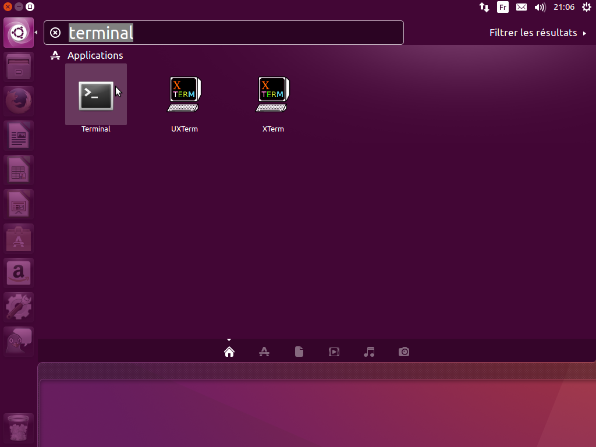
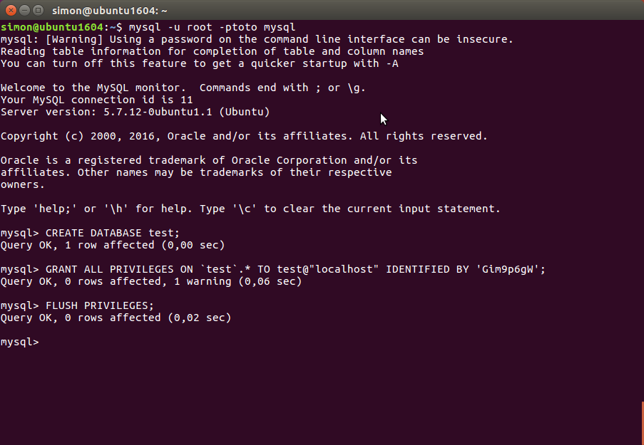
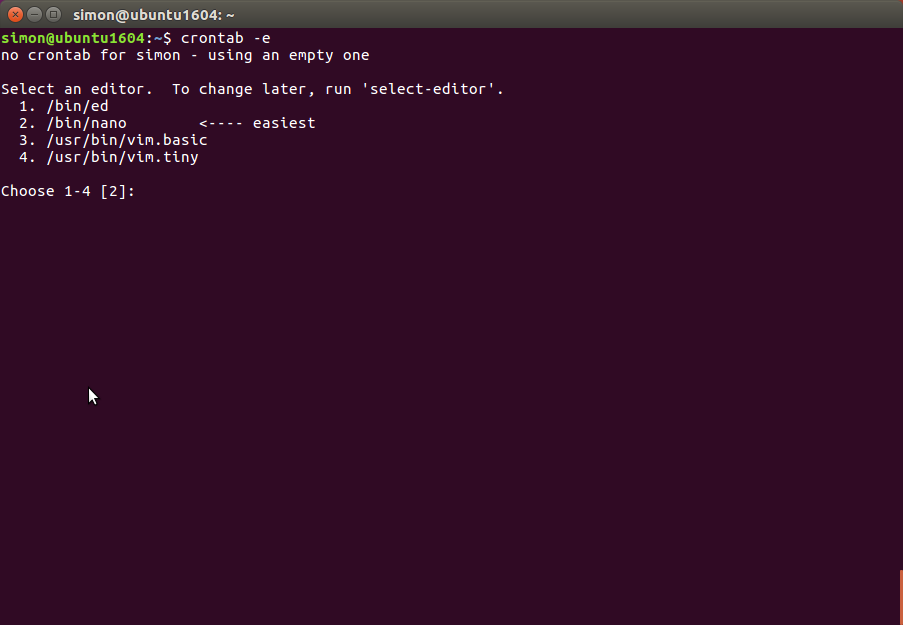
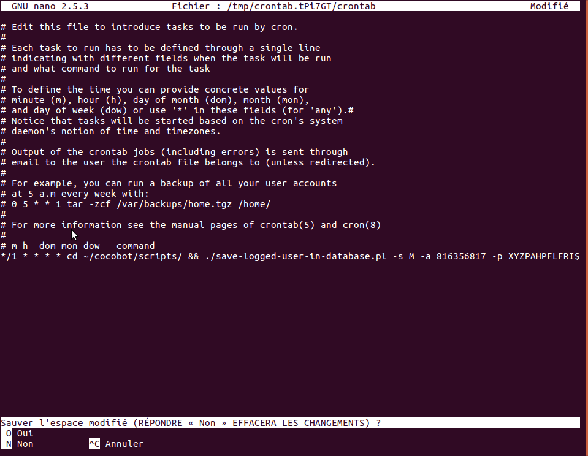
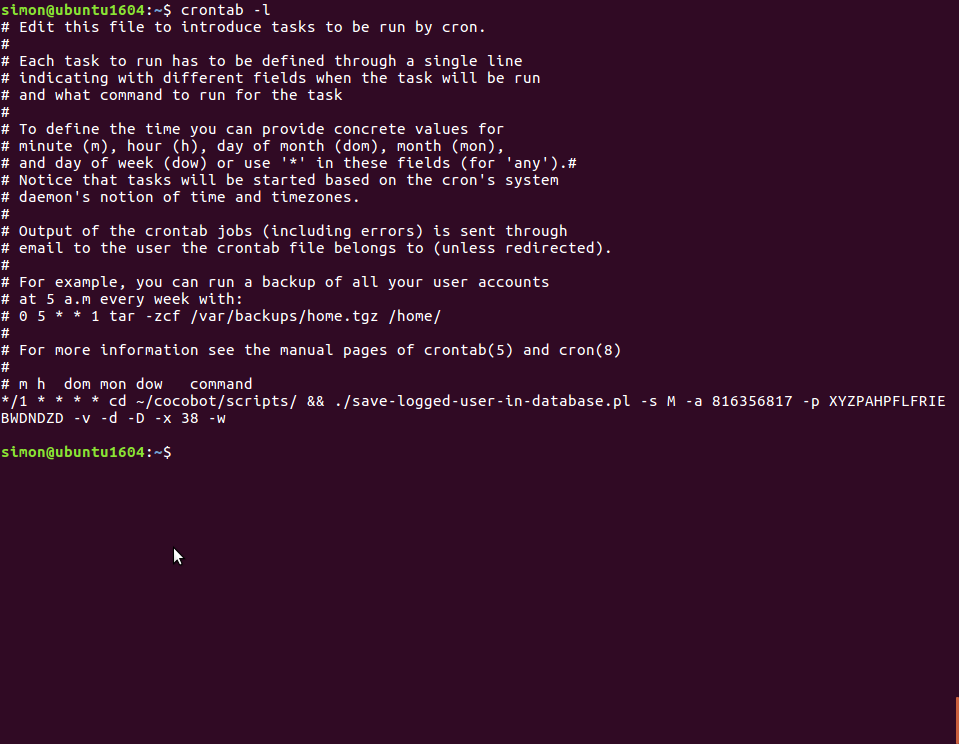
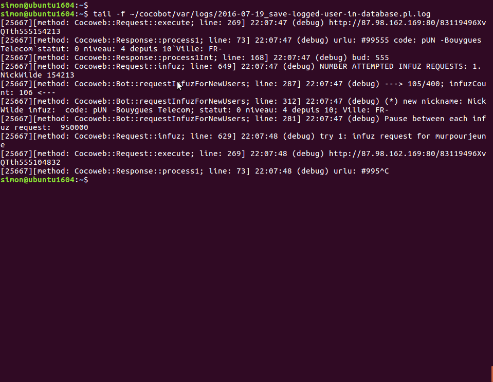

# Introduction #

Cette page explique l'installation et l'utilisation pas à pas du script « save-logged-user-in-database.pl ».

Le script « save-logged-user-in-database.pl » créé un bot qui se connecte sur Coco.fr et va lire la liste des pseudos connectés sur le chat plusieurs fois par minutes, puis enregistre toutes les connexions et déconnexions des pseudos dans une base de données MySQL. Le script est prévu pour fonctionner 24 heures sur 24 et sept jours sur sept et nécessite de souscrire un abonnement Premium payant sur Coco.fr. [Lire la documentation sur comment souscrire à un abonnement Premium sur le site Coco.fr](cocoRegistration.md).

Cette documentation se base sur le système d'exploitation [Ubuntu 16.04 Desktop](http://www.ubuntu-fr.org/telechargement), donc pour installer ce script un système d'exploitation Ubuntu 16.04 Desktop est requis.

Toutes les manipulations se font à l'aide de la [ligne de commande](http://fr.wikipedia.org/wiki/Ligne_de_commande), donc une connaissance minimum de l'utilisation de la ligne de commande dans un terminal est nécessaire.


# Installation #

## Installer les dépendances ##

Lancer le logiciel [Terminal](http://fr.wikipedia.org/wiki/Gnome_Terminal) pour pouvoir utiliser les commandes en ligne de commande.

Pour lancer le Terminal, cliquer tout en haut à droite de l'écran sur le logo Ubuntu. Ensuite taper le mot « terminal » dans la zone de recherche :




Taper la commande suivante pour installer certains logiciels :
```
sudo apt install git libconfig-general-perl libwww-perl libdbd-mysql-perl libdbd-sqlite3-perl libnet-xmpp-perl mysql-server librivescript-perl
```

À l'installation de MySQL, le programme d'installation demande un mot de passe pour l'utilisateur « root ». Dans cet exemple le mot de passe « toto » a été donné.

## Récupérer le code source ##

Taper la commande suivante sur dans Terminal pour récupérer le code source :
```
git clone https://github.com/simonrubinstein/cocobot.git
```

## Créer la base de données MySQL ##

La base de données MySQL utilisée dans l'exemple est la base de données « test ». Cette base de données était créée par défaut à l'installation des précédentes version de MySQL, ce n'est plus le cas avec la version 5.7 de MySQL. L'utilisateur de la base de données aura le même nom, c'est à dire « test » et le mot de passe sera « Gim9p6gW ». Ces trois paramètres peuvent être changés dans le fichier de configuration.

Taper les quatre commandes suivants dans Terminal pour créer la base de données « test » et son utilisateur MySQL « test » :
```
mysql -u root -ptoto mysql
CREATE DATABASE test;
GRANT ALL PRIVILEGES ON `test`.* TO test@"localhost" IDENTIFIED BY 'Gim9p6gW';
FLUSH PRIVILEGES;
exit
```



Pour utiliser une autre base de données MySQL, un autre utilisateur ou un autre mot de passe, le fichier « database.conf » doit-être modifié en conséquence :
```
cat ~/cocobot/conf/database.conf 
<conf>
  #database-class     = SQLite
  database-class     = MySQL 
  sqlite-filename    = logged-users.db
  ISO-3166-1-alpha-2 = (FR|GF|GP|MQ|NC|PF|RE)\-
  code-regex         = [A-Za-z0-9]{3}
  dbi-datasource    = dbi:mysql:database=test:host=localhost
  dbi-username      = test
  dbi-password      = Gim9p6gW
  dbi-timeout       = 30
</conf>
```

### Initialiser la base de données MySQL ###

Les tables de la base de données MySQL doivent-être créées et certaines tables peuplées avec des données :
```
cd ~/cocobot/tools/
./initializes-database.pl
```

Le script peut prendre quelques secondes ou minutes avant de rendre la main. Par exemple, le script « initializes-database.pl » s'est exécuté en 1 537 secondes, donc plus de vingt-cinq minutes, sur une petite machine physique pas très rapide.


## Configurer le script dans la table du programme cron ##

L'objectif est de lancer le script « save-logged-user-in-database.pl » toutes les minutes. Pour cela nous allons configurer le programme [cron](http://fr.wikipedia.org/wiki/Cron) pour qu'il exécute le script « save-logged-user-in-database.pl » toutes les minutes.

Tout d'abord vous devez récupérer les valeurs de « myavatar » et « mypass » d'un compte ayant un abonnement payant Premium. Lire la documentation sur [comment souscrire à un abonnement Premium sur le site Coco.fr et récupérer les valeurs de « myavatar » et « mypass »](cocoRegistration.md).

Dans notre exemple nous utiliserons :
  * « myavatar » correspond à la valeur « 816356817 »
  * « mypass » correspond à la valeur « XYZPAHPFLFRIEBWDNDZD ».

Ces valeurs de « myavatar » et « mypass » sont données uniquement à titre d'exemple et ne fonctionneront pas. Vous [devez souscrire à un abonnement Premium](cocoRegistration.md) de cinq euros par mois.

Nous allons lancer [le programme crontab](http://fr.wikipedia.org/wiki/Crontab) qui permet d'éditer des tables de configuration du programme _cron_.

Taper la commande suivante dans un terminal pour éditer la table de configuration du programme _cron_ :
```
crontab -e
```

À la première utilisation, le programme _crontab_ vous demande quel éditeur texte vous allez utiliser. Sélectionner le choix conseillé en tapant sur la touche _2_ du clavier pour choisir l'éditeur [nano](http://fr.wikipedia.org/wiki/GNU_nano)] :



Une fois l'éditeur _nano_ lancé, presser sur la touche directionnelle bas pour se rendre tout à la fin du texte et insérer la ligne suivante :

```
*/1 * * * * cd ~/cocobot/scripts/ && ./save-logged-user-in-database.pl -s M -a 816356817 -p XYZPAHPFLFRIEBWDNDZD -v -d -D -x 38 -w
```

Ensuite taper les touches _Ctrl + X_ pour quitter l'éditeur _nano_. Le message «  Sauver l'espace modifié (RÉPONDRE « Non » EFFACERA LES CHANGEMENTS) ? » s'affichera alors. Presser la touche _O_ puis ensuite la touche _entrée_ pour sauvegarder :



Pour vérifier si la table de configuration du programme _cron_ est bien paramétrée taper la commande :
```
crontab -l
```

Si la table de configuration du programme _cron_ est bien paramétrée vous devriez voir ce résultat :



Voici une explication des paramètres passés au script « save-logged-user-in-database.pl » :
  * -s M : le pseudo créé sera toujours un pseudo homme.
  * -a  816356817 : la valeur de « myavatar »  pour l'authentification sur Coco.fr.
  * -p XYZPAHPFLFRIEBWDNDZD : la valeur de « mypass »  pour l'authentification sur Coco.fr.
  * -v : mode verbeux, le script affiche quelques messages .
  * -d : mode debug, le script affiche des messages de debug.
  * -D : mode debug, le script affiche encore plus de messages de debug.
  * -x 38 : le script réalise trente-huit itérations avant de quitter.
  * -w  : le script écrira les logs dans le répertoire « ~/cocobot/var/log ».

Visionner le fichier de log du script pour vérifier que le script « save-logged-user-in-database.pl » est bien lancé toutes les minutes. Le fichier de log est composé avec la date du jour. Par exemple cette documentation a été écrite le 7 décembre 2012, donc le fichier de log se nomme « 2012-12-07\_save-logged-user-in-database.pl.log ». Utiliser la commande suivante pour le visionner :

```
tail -f ~/cocobot/var/logs/2012-12-07_save-logged-user-in-database.pl.log
```


Si vous voyez un résultat semblable à cette capture d'écran, alors le script « save-logged-user-in-database.pl » fonctionne :




Taper CTRL + C pour stopper la [commande tail](http://fr.wikipedia.org/wiki/Tail_%28Unix%29). Et maintenant vous pouvez utiliser la commande « [db-search.pl](dbSearch.md) » pour consulter la base de données.

Exemple cette commande affiche les pseudos femmes actuellement connectés sur le tchat :
```
cd ~/cocobot/scripts
./db-search.pl -O -s 2,7
```

### Exemple pouvant être utilisé dans la table de configuration cron ###

Cet exemple utilise le pseudo homme « AmantMaudit » âgé de quarante-trois ans et active les alertes avec l'option -A.
```
*/1 * * * * cd ~/cocobot/scripts/ && ./save-logged-user-in-database.pl -s M -a 363767485 -p XYCVDJVTGINYMAGLSTLQ -v -d -D -x 37 -w -A -u AmantMaudit -y 43 > /dev/null 2>&1
```

Cet exemple utilise le liste de pseudos séparés par le caractère double point. Un des pseudos sera choisi au hasard :
```
*/1 * * * * cd ~/cocobot/scripts/ && ./save-logged-user-in-database.pl -s M -a 176523003 -p XYOOVXRWLINLYOLTMATS -v -d -D -x 35 -w -A -u AlwaysThere:AnyLove:BarbeDure:BeamMeUp:BetterDays:BoudoirSecret:BurningHot:ComeOnGirl:DeliverMe:DejaVu:FlyAway:FollowYourHeart:FoundAReason:IAmAMan:IAmBlessed:IWannaKnow:JustifyMyLove:KnockMeAKiss:LadyKillers:LangueDeChat:LoveSensation:NoWorries:OuEstMaTete:OnlyForGirls:PenniesOfHeaven:MindFluid:MisterB:MisterSwing:NuyoricanSoul:PeaceAndNoise:RoiDePique:RunAway:RomeoKnight:sayThatYouLoveMe:ShootMeWithLove:SoSweetly:StandOnTheWord:StayWithMe:SugarBeets:TheBigBadWolf:TheLookOfLove:WhatAboutMyLove:ZeBigBoss:KwisatzHaderach:HypnoFreaks:SweetTears:DoctorLove:ProfessorFeat:MinistryOfLove:SweetTalk:Misunderstanding:BodySwerve:SugarMan:LoveNeverFails:EternalLover -y 43 > /dev/null 2>&1
```

Cet exemple  prend le fichier « _plain-text/nicknames-bot.txt_ » est comme paramètre pour le pseudo. Ce fichier contient un pseudo par ligne, un pseudo sera sélectionné au hasard. L'option « -g » est également utilisée pour forcer à charger l'image de l'avatar. Si le compte utilisé (identifié par les option « -a » et -« -p ») possède une image pour son avatar et que l'option « -g » n'est pas précisé alors l'image de l'avatar ne sera pas chargé :
```
*/1 * * * * cd ~/cocobot/scripts/ && ./save-logged-user-in-database.pl -g -s M -a 176523003 -p XYOOVXRWLINLYOLTMATS -v -d -D -x 37 -w -A -u file:///plain-text/nicknames-bot.txt -y 43 > /dev/null 2>&1
```


## Options du script « save-logged-user-in-database.pl » ##

Utilisation :
```
save-logged-user-in-database.pl [-A] -x maxOfLoop -S seconds -a myavatar -p mypass [-u mynickname -y myage -s mysex -v -d -D -w]
```

  * **-x** maxOfLoop : nombre d'itérations avant de quitter.
  * **-S** seconds   : nombre de secondes attendues avant la prochaine itération. Cette option est ignorée, la valeur est toujours d'une seconde
  * **-a** myavatar  : l'identifiant unique de compte qui doit être Premium. Ce sont les neuf premiers chiffres du cookie HTTP portant le nom « samedi ».
  * **-p** mypass     : le mot de passe du compte Premium. Les vingt derniers caractères alphabétiques du cookie HTTP « samedi ».
  * **-u** mynickname : Un pseudo utilisé pour le bot, une liste de pseudos séparés par le caractère double point ou un fichier contenant un pseudo par ligne. Si aucun pseudo n'est précisé un pseudo est sélectionné aléatoirement.
  * **-y** myage       : Un âge de 18 à 89 ans. Si aucun âge n'est précisé alors ce dernier est sélectionné aléatoirement.
  * **-s** :Le sexe utilisé pour le bot : « M » pour homme ou « W » pour femme. Si le sexe n'est pas précisé il est sélectionné aléatoirement.
  * **-g** : Lance la requête pour charger l'image de l'avatar. Si le bot possède une image en avatar cette option permettra de le charger.
  * **-v**  : Mode bavard. Affiche des messages d'informations.
  * **-d**  : Affiche des messages de debug.
  * **-D**  : Affiche davantage de messages de debug.
  * **-w**  : Affiche les logs dans un fichier.
  * **-A**  : Active les alertes. Permet d'envoyer des messages XMPP ou écrire aux utilisateurs connectés sur le tchat en se basant sur le fichier « alert.conf ». [Lire la page sur les alertes](LesAlertes.md).
